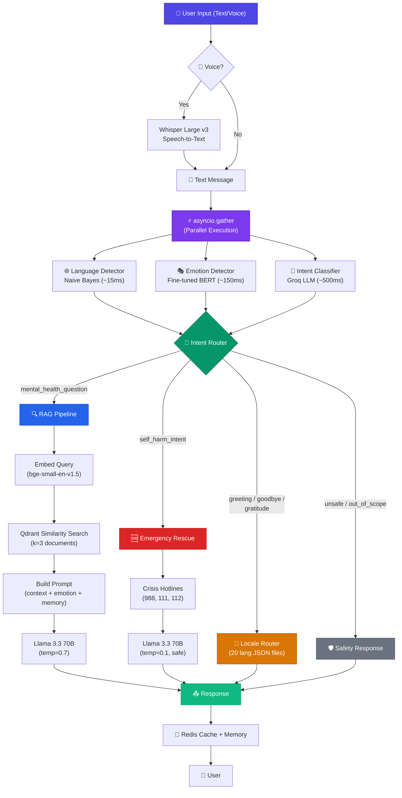

<p align="center">
  
  
  
  
  
  
  
  
</p>

<h1 align="center">🧠 MindBridge — Mental Health RAG Chatbot</h1>

<p align="center">
  <strong>An AI-powered mental health support system combining Retrieval-Augmented Generation, emotion detection, and crisis intervention — supporting 20 languages with voice input.</strong>
</p>

<p align="center">
  <a href="#-key-features">Features</a> •
  <a href="#-system-architecture">Architecture</a> •
  <a href="#-tech-stack">Tech Stack</a> •
  <a href="#-ml-models--pipeline">ML Pipeline</a> •
  <a href="#-api-reference">API Reference</a> •
  <a href="#-getting-started">Getting Started</a> •
  <a href="#-project-structure">Project Structure</a> •
  <a href="#-contributing">Contributing</a>
</p>

---

## 📖 Overview

**MindBridge** is an advanced NLP-driven mental health chatbot that provides **empathetic, context-aware, and safe** conversational support. Built on a **Retrieval-Augmented Generation (RAG)** architecture, it retrieves evidence-based counseling knowledge and generates personalized responses while detecting user emotions and routing crisis situations to emergency resources.

The system goes far beyond simple Q&A: it understands user intent, detects emotional state, remembers conversation context, speaks 20 languages natively, and accepts voice input — all while maintaining strict safety guardrails against prompt injection and self-harm situations.

### 🎯 Why MindBridge?

| Challenge | Our Solution |
|-----------|-------------|
| Generic chatbot responses | RAG retrieves **real counseling knowledge** from a curated vector database |
| Missing emotional context | Fine-tuned **BERT emotion classifier** adapts tone and content |
| Language barriers | **20 native languages** with script-aware preprocessing |
| Crisis situations | **Emergency rescue system** with real crisis hotline numbers |
| Slow response times | **Parallel ML inference** + multi-layer **Redis caching** |
| Security concerns | **JWT auth**, prompt injection detection, and safety guardrails |

---

## ✨ Key Features

### 🔍 Retrieval-Augmented Generation (RAG)
- Embeds user queries with **BAAI/bge-small-en-v1.5** sentence transformer
- Performs semantic search over **Qdrant Cloud** vector database of mental health counseling documents
- Generates contextual, evidence-backed responses using **Llama 3.3 70B** via Groq

### 🎭 Emotion Detection
- Fine-tuned **BERT** model classifies 6 core emotions: `sadness`, `joy`, `love`, `anger`, `fear`, `surprise`
- Emotion awareness allows the LLM to tailor its empathetic response style

### 🧭 Intent Classification
- LLM-based classifier (Llama 3.1 8B, JSON mode) routes queries into 7 intents:
  - `asking_mental_health_question` → RAG pipeline
  - `self_harm_intent` → Emergency rescue system
  - `greeting` / `goodbye` / `gratitude` → Localized quick responses
  - `unsafe_query` / `out_of_scope` → Safety guardrails

### 🆘 Emergency Rescue System
- Dedicated crisis intervention pipeline with **temperature 0.1** for controlled, safe responses
- Includes real crisis hotline numbers (988 Lifeline, 111/999, 112, and regional numbers)
- Priority routing — detected self-harm intent bypasses all other processing

### 🌍 Multilingual Support (20 Languages)
- Full locale support: `ar` `bg` `de` `el` `en` `es` `fr` `hi` `it` `ja` `nl` `pl` `pt` `ru` `sw` `th` `tr` `ur` `vi` `zh`
- Script-aware preprocessing (Arabic, CJK, Thai, Latin, Cyrillic, Devanagari)
- Custom **Naive Bayes** language detection pipeline with Unicode script analysis

### 🎤 Voice Input
- Browser-based audio recording via MediaRecorder API (WebM/Opus)
- Transcription via **OpenAI Whisper Large v3** (HuggingFace Inference API)
- Seamless text pipeline integration after transcription

### ⚡ Smart Caching & Memory
- **Redis-backed semantic cache** with namespace-based keys and SHA-256 hashing
- Separate TTLs for each operation (language, emotion, intent, RAG, memory)
- **Per-user conversation memory** (10 turns, 24h TTL) injected into RAG context
- Graceful degradation — system works without Redis, just without caching

### 🔐 Authentication & Security
- JWT access tokens with 24-hour expiration
- Bcrypt password hashing via Passlib
- SQLite user database
- Prompt injection and jailbreak detection guardrails

---

## 🏗 System Architecture

```
┌─────────────────────────────────────────────────────────────────────┐
│                         CLIENT (Browser)                            │
│  ┌──────────────┐   ┌──────────────┐   ┌────────────────────────┐  │
│  │  Login Page   │   │  Chat UI     │   │  MediaRecorder (Voice) │  │
│  │  (login.html) │──▶│ (index.html) │   │  WebM/Opus Audio       │  │
│  └──────────────┘   └──────┬───────┘   └──────────┬─────────────┘  │
│                            │ JWT Bearer             │                │
└────────────────────────────┼────────────────────────┼────────────────┘
                             ▼                        ▼
┌─────────────────────────────────────────────────────────────────────┐
│                     FastAPI Server (api.py)                          │
│  ┌──────────────┐  ┌──────────────┐  ┌───────────────────────────┐ │
│  │ Auth Routes   │  │ Chat Route   │  │ Voice Route               │ │
│  │ /api/register │  │ /api/chat    │  │ /api/chat/voice           │ │
│  │ /api/login    │  │              │  │ Whisper STT → text → chat │ │
│  └──────┬───────┘  └──────┬───────┘  └──────────────┬────────────┘ │
│         │                  │                          │              │
│         ▼                  ▼                          ▼              │
│  ┌──────────────┐  ┌─────────────────────────────────────────────┐ │
│  │ Auth Module   │  │         Pipeline Orchestrator               │ │
│  │ SQLite + JWT  │  │              (pipeline.py)                  │ │
│  │ + bcrypt      │  │                                             │ │
│  └──────────────┘  │  ┌─────────────────────────────────────┐    │ │
│                     │  │   asyncio.gather (Parallel Fan-Out)  │    │ │
│                     │  │  ┌───────────┬───────────┬─────────┐│    │ │
│                     │  │  │ Language   │ Emotion   │ Intent  ││    │ │
│                     │  │  │ Detector   │ Detector  │Classifr ││    │ │
│                     │  │  │ NaiveBayes │ BERT      │Groq LLM ││    │ │
│                     │  │  │ (~15ms)    │ (~150ms)  │(~500ms) ││    │ │
│                     │  │  └─────┬─────┴─────┬─────┴────┬────┘│    │ │
│                     │  └────────┼───────────┼──────────┼─────┘    │ │
│                     │           ▼           ▼          ▼          │ │
│                     │  ┌─────────────────────────────────────┐    │ │
│                     │  │        Intent Router                 │    │ │
│                     │  │  ┌─────────────────────────────────┐│    │ │
│                     │  │  │ mental_health_question           ││    │ │
│                     │  │  │   → RAG Chain                    ││    │ │
│                     │  │  │   (Embed→Qdrant→Llama 3.3 70B)  ││    │ │
│                     │  │  ├─────────────────────────────────┤│    │ │
│                     │  │  │ self_harm_intent                 ││    │ │
│                     │  │  │   → Emergency Rescue System      ││    │ │
│                     │  │  │   (Crisis hotlines + safe LLM)   ││    │ │
│                     │  │  ├─────────────────────────────────┤│    │ │
│                     │  │  │ greeting/goodbye/gratitude/      ││    │ │
│                     │  │  │ unsafe/out_of_scope              ││    │ │
│                     │  │  │   → Locale Router (JSON i18n)    ││    │ │
│                     │  │  └─────────────────────────────────┘│    │ │
│                     │  └─────────────────────────────────────┘    │ │
│                     └─────────────────────────────────────────────┘ │
│                                        │                            │
│                     ┌──────────────────┼──────────────────┐         │
│                     ▼                  ▼                  ▼         │
│              ┌────────────┐   ┌──────────────┐   ┌──────────────┐  │
│              │ Redis Cache │   │ Redis Memory │   │ Redis Cache   │  │
│              │ (lang/emo/  │   │ (Per-user    │   │ (RAG/rescue   │  │
│              │  intent)    │   │  10 turns)   │   │  responses)   │  │
│              └────────────┘   └──────────────┘   └──────────────┘  │
└─────────────────────────────────────────────────────────────────────┘

┌─────────────────── External Services ───────────────────────────────┐
│  ┌──────────────┐  ┌──────────────┐  ┌───────────────────────────┐ │
│  │ Groq Cloud    │  │ Qdrant Cloud │  │ HuggingFace Inference API │ │
│  │               │  │              │  │                           │ │
│  │ • llama-3.1   │  │ • Vector DB  │  │ • Whisper Large v3        │ │
│  │   -8b-instant │  │ • Mental     │  │   (Speech-to-Text)        │ │
│  │   (Intent)    │  │   Health     │  │                           │ │
│  │ • llama-3.3   │  │   Knowledge  │  │                           │ │
│  │   -70b-versa  │  │   Base       │  │                           │ │
│  │   (RAG+Rescue)│  │              │  │                           │ │
│  └──────────────┘  └──────────────┘  └───────────────────────────┘ │
└─────────────────────────────────────────────────────────────────────┘
```

### Pipeline Flow Diagram



---

## 🛠 Tech Stack

### Backend & ML

| Component | Technology | Purpose |
|-----------|-----------|---------|
| **Web Framework** | FastAPI + Uvicorn | Async REST API server |
| **LLM Provider** | Groq Cloud API | Ultra-fast LLM inference |
| **LLM Models** | Llama 3.1 8B (intent) / Llama 3.3 70B (RAG & rescue) | Text generation |
| **RAG Framework** | LangChain | Retrieval-augmented generation orchestration |
| **Vector Database** | Qdrant Cloud | Semantic search over knowledge base |
| **Embeddings** | BAAI/bge-small-en-v1.5 | Query & document embedding |
| **Emotion Model** | Fine-tuned BERT | 6-class emotion classification |
| **Language Detection** | Custom Naive Bayes | 20-language identification |
| **Speech-to-Text** | OpenAI Whisper Large v3 | Voice input transcription |
| **Cache** | Redis (hiredis) | Multi-namespace semantic caching |
| **Auth** | JWT + bcrypt + SQLite | User authentication |

### Frontend

| Component | Technology |
|-----------|-----------|
| **UI Framework** | Vanilla HTML / CSS / JavaScript |
| **Voice Recording** | Browser MediaRecorder API (WebM/Opus) |
| **Auth Flow** | JWT tokens in localStorage |
| **Design** | Dark theme, modern chat interface |

---

## 🤖 ML Models & Pipeline

### Models Overview

| Model | Type | Size | Location | Purpose |
|-------|------|------|----------|---------|
| **Fine-tuned BERT** | Classifier | ~438 MB | `emotion-bert-final/` | Emotion detection (6 classes) |
| **Naive Bayes Pipeline** | scikit-learn | ~35 MB | `classifier/*.joblib` | Language detection (20 langs) |
| **BAAI/bge-small-en-v1.5** | Sentence Transformer | ~33 MB | Downloaded at runtime | Query embeddings for RAG |
| **Llama 3.1 8B Instant** | LLM (Groq API) | Cloud | Groq | Intent classification (JSON mode, temp=0) |
| **Llama 3.3 70B Versatile** | LLM (Groq API) | Cloud | Groq | RAG generation (temp=0.7) & rescue (temp=0.1) |
| **Whisper Large v3** | ASR | Cloud | HuggingFace API | Speech-to-text transcription |

### Emotion Classes
```
😢 sadness  │  😊 joy  │  ❤️ love  │  😠 anger  │  😨 fear  │  😮 surprise
```

### Intent Categories
```
💬 greeting                    →  Locale-based quick response
👋 goodbye                     →  Locale-based quick response
🙏 gratitude                   →  Locale-based quick response
❓ asking_mental_health_question →  Full RAG pipeline
🆘 self_harm_intent             →  Emergency rescue system
⚠️  unsafe_query                →  Safety guardrail response
🚫 out_of_scope                →  Polite redirection
```

### Parallel Processing Architecture

All three classification tasks execute **concurrently** via `asyncio.gather`, collapsing what would be ~665ms of serial processing into a single ~500ms parallel block:

```
Time ──────────────────────────────────────▶

  Language Detection  ████ (~15ms)
  Emotion Detection   ████████████████ (~150ms)
  Intent Classification ████████████████████████████████████████ (~500ms)

  Total: ~500ms (vs ~665ms serial) — 25% faster
```

---

## 📡 API Reference

### Authentication

| Method | Endpoint | Auth | Description |
|--------|----------|------|-------------|
| `POST` | `/api/register` | ❌ | Register a new user account |
| `POST` | `/api/login` | ❌ | Login and receive JWT token |

#### Register
```bash
curl -X POST http://localhost:8000/api/register \
  -H "Content-Type: application/json" \
  -d '{"username": "user1", "password": "securepass123"}'
```
```json
{
  "token": "eyJhbGciOiJIUzI1NiIs...",
  "username": "user1"
}
```

#### Login
```bash
curl -X POST http://localhost:8000/api/login \
  -H "Content-Type: application/json" \
  -d '{"username": "user1", "password": "securepass123"}'
```

---

### Chat

| Method | Endpoint | Auth | Description |
|--------|----------|------|-------------|
| `POST` | `/api/chat` | ✅ Bearer | Send a text message |
| `POST` | `/api/chat/voice` | ✅ Bearer | Send a voice recording |

#### Text Chat
```bash
curl -X POST http://localhost:8000/api/chat \
  -H "Authorization: Bearer <token>" \
  -H "Content-Type: application/json" \
  -d '{"message": "I have been feeling really anxious lately"}'
```
```json
{
  "original_message": "I have been feeling really anxious lately",
  "detected_language": "en",
  "detected_emotion": "fear",
  "detected_intent": "asking_mental_health_question",
  "response": "I hear you, and I want you to know that feeling anxious is...",
  "source": "RAG Model"
}
```

#### Voice Chat
```bash
curl -X POST http://localhost:8000/api/chat/voice \
  -H "Authorization: Bearer <token>" \
  -F "audio=@recording.webm"
```
```json
{
  "transcribed_text": "I have been feeling really anxious lately",
  "detected_language": "en",
  "detected_emotion": "fear",
  "detected_intent": "asking_mental_health_question",
  "response": "I hear you, and I want you to know that...",
  "source": "RAG Model"
}
```

---

### Pages

| Method | Endpoint | Description |
|--------|----------|-------------|
| `GET` | `/` | Login / Register page |
| `GET` | `/chat` | Chat interface (requires auth) |

---

## ⚙️ Configuration

### Environment Variables

Create a `.env` file in the project root:

```env
# ─── Required ──────────────────────────────────────
GROQ_API_KEY=gsk_your_groq_api_key
HF_TOKEN=hf_your_huggingface_token
QDRANT_URL=https://your-cluster.qdrant.io:6333
QDRANT_API_KEY=your_qdrant_api_key

# ─── Optional (defaults shown) ────────────────────
JWT_SECRET=your-super-secret-jwt-key
REDIS_URL=redis://localhost:6379/0
EMOTION_MODEL_PATH=./emotion-bert-final
```

### Cache TTL Configuration

| Cache Namespace | TTL | Purpose |
|----------------|-----|---------|
| Language Detection | 1 hour | Cached language predictions |
| Emotion Detection | 1 hour | Cached emotion classifications |
| Intent Classification | 1 hour | Cached intent predictions |
| RAG Responses | 30 min | Cached generated answers |
| Chat Memory | 24 hours | Per-user conversation history |

### Other Settings

| Setting | Default | Description |
|---------|---------|-------------|
| `JWT_ALGORITHM` | HS256 | JWT signing algorithm |
| `JWT_EXPIRE_HOURS` | 24 | Token expiration time |
| `MAX_MEMORY_MESSAGES` | 10 | Conversation turns to remember |
| Intent Confidence Threshold | 0.65 | Minimum confidence for intent routing |

---

## 🚀 Getting Started

### Prerequisites

- **Python 3.11+**
- **Redis** (optional, for caching — system works without it)
- API keys for **Groq**, **HuggingFace**, and **Qdrant Cloud**

### Installation

```bash
# 1. Clone the repository
git clone https://github.com/Fayad-nullPointer/Health-Rag-System.git
cd Health-Rag-System

# 2. Switch to the development branch
git checkout Rag_Pipeline_Development

# 3. Create and activate virtual environment
python -m venv venv
source venv/bin/activate  # On Windows: venv\Scripts\activate

# 4. Install dependencies
pip install -r requirements.txt

# 5. Set up environment variables
cp .env.example .env
# Edit .env with your API keys (see Configuration section)

# 6. Ensure the emotion model is present
# The fine-tuned BERT model should be in ./emotion-bert-final/
# Download from: https://huggingface.co/Fayad11/fine_tuned_emotion_inference_model

# 7. (Optional) Start Redis for caching
redis-server

# 8. Run the application
python api.py
```

### Access the Application

| URL | Description |
|-----|-------------|
| `http://localhost:8000` | Login / Register page |
| `http://localhost:8000/chat` | Chat interface |

### Docker Deployment

```bash
# Build the image
docker build -t mindbridge .

# Run with environment variables
docker run -p 8000:8000 --env-file .env mindbridge
```

---

## 📁 Project Structure

```
Health-Rag-System/
│
├── 🚀 api.py                        # FastAPI entry point — lifespan model loading, CORS, routing
├── 🔐 auth.py                       # JWT authentication — register, login, bcrypt, SQLite
├── ⚡ cache_layer.py                 # Redis cache wrapper — namespaced keys, graceful degradation
├── ⚙️ config.py                      # Centralized configuration — env vars, TTLs, constants
├── 🧠 memory.py                     # Per-user conversation memory — Redis-backed, 10 turns
├── 🔬 pipeline.py                   # ML pipeline orchestrator — parallel inference, RAG chain
├── 🧪 test.py                       # API test endpoint
├── 📦 requirements.txt              # Python dependencies (~49 packages)
├── 🐳 Dockerfile                    # Container configuration
├── 📖 README.md                     # This file
├── 🔑 .env                          # Environment variables (not committed)
│
├── 📂 routes/                       # API route modules
│   ├── __init__.py
│   ├── auth_routes.py               # POST /api/register, /api/login
│   └── chat.py                      # POST /api/chat, /api/chat/voice
│
├── 📂 classifier/                   # ML model modules
│   ├── intent_classifier.py         # LLM-based intent classification + routing
│   ├── language_inference.py        # Naive Bayes language detection (20 langs)
│   ├── emotion_inference.py         # Fine-tuned BERT emotion classification
│   ├── preprocessor.py             # Script-aware text preprocessing (Unicode)
│   ├── utils.py                     # Locale path utilities
│   └── *.joblib                     # Serialized ML models
│
├── 📂 static/                       # Frontend files
│   ├── login.html                   # Login & registration page
│   └── index.html                   # Chat interface (authenticated)
│
├── 📂 locales/                      # Internationalization (20 languages)
│   ├── en.json                      # English
│   ├── ar.json                      # Arabic (RTL)
│   ├── de.json, es.json, fr.json    # European languages
│   ├── ja.json, zh.json, th.json    # Asian languages
│   └── ... (20 total)               # bg, el, hi, it, nl, pl, pt, ru, sw, tr, ur, vi
│
├── 📂 emotion-bert-final/           # Fine-tuned BERT model (~438 MB)
│   ├── config.json                  # Model configuration (6 classes)
│   ├── model.safetensors            # Model weights
│   ├── tokenizer.json               # Tokenizer
│   └── tokenizer_config.json        # Tokenizer configuration
│
├── 📂 faiss_mental_health_index/    # Legacy local FAISS index
│   ├── index.faiss                  # Vector index (~9.3 MB)
│   └── index.pkl                    # Document metadata (~4.5 MB)
│
├── 📓 Rag_Notebook.ipynb            # RAG pipeline development notebook
├── 📓 notebook.ipynb                # Additional experiments
└── 📂 classifier/
    └── 📓 emotions_classifier.ipynb # BERT emotion model training notebook
```

---

## 🔧 Design Patterns & Engineering Decisions

| Pattern | Implementation | Benefit |
|---------|---------------|---------|
| **Lifespan Dependency Injection** | Models loaded once in FastAPI `lifespan`, injected as module globals | Zero per-request model loading overhead |
| **Parallel Fan-Out** | `asyncio.gather` for language + emotion + intent | ~25% faster than serial execution |
| **Graceful Degradation** | Redis operations wrapped in try/except with silent fallback | System works without Redis, just slower |
| **Multi-Level Caching** | SHA-256 → namespace-based Redis keys with per-operation TTLs | Intelligent cache hits without false matches |
| **Intent-Based Routing** | Switch-style routing post-classification | Clean separation of response strategies |
| **Module-as-Singleton** | `pipeline.py` module-level globals set once during startup | Thread-safe shared model instances |
| **LRU-Cached Locales** | `@lru_cache` on locale JSON loading | Zero-cost repeated locale access |
| **Script-Aware Preprocessing** | Unicode block detection → appropriate tokenization | Accurate processing for Arabic, CJK, Thai, etc. |

---

## 🌐 Supported Languages

<table>
<tr>
<td>🇺🇸 English (en)</td>
<td>🇸🇦 Arabic (ar)</td>
<td>🇧🇬 Bulgarian (bg)</td>
<td>🇩🇪 German (de)</td>
</tr>
<tr>
<td>🇬🇷 Greek (el)</td>
<td>🇪🇸 Spanish (es)</td>
<td>🇫🇷 French (fr)</td>
<td>🇮🇳 Hindi (hi)</td>
</tr>
<tr>
<td>🇮🇹 Italian (it)</td>
<td>🇯🇵 Japanese (ja)</td>
<td>🇳🇱 Dutch (nl)</td>
<td>🇵🇱 Polish (pl)</td>
</tr>
<tr>
<td>🇵🇹 Portuguese (pt)</td>
<td>🇷🇺 Russian (ru)</td>
<td>🇹🇿 Swahili (sw)</td>
<td>🇹🇭 Thai (th)</td>
</tr>
<tr>
<td>🇹🇷 Turkish (tr)</td>
<td>🇵🇰 Urdu (ur)</td>
<td>🇻🇳 Vietnamese (vi)</td>
<td>🇨🇳 Chinese (zh)</td>
</tr>
</table>

---

## 🆘 Crisis Resources

MindBridge includes an **Emergency Rescue System** that activates automatically when self-harm intent is detected. It provides:

- 🇺🇸 **988 Suicide & Crisis Lifeline** (US): Call/Text 988
- 🇬🇧 **Samaritans** (UK): 116 123
- 🇪🇺 **European Emergency**: 112
- 🌍 **Regional hotlines** for Middle East, North Africa, and more

> ⚠️ **Important**: MindBridge is an AI assistant and does **not** replace professional mental health care. If you or someone you know is in crisis, please contact local emergency services immediately.

---

## 👥 Team

**Fayad-nullPointer** — ITI NLP & LLM Final Project

---

## 📄 License

This project is developed as part of the **Information Technology Institute (ITI)** NLP and LLM program.

---

<p align="center">
  <strong>Built with ❤️ for mental health awareness and support</strong>
</p>

<p align="center">
  
  
  
  
</p>
