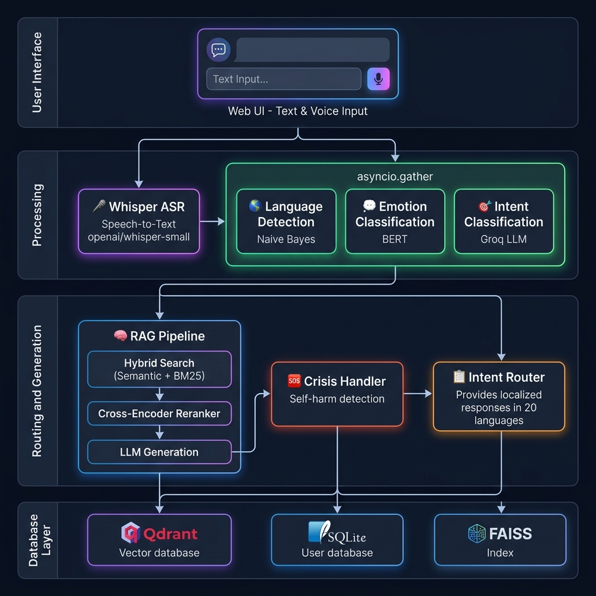
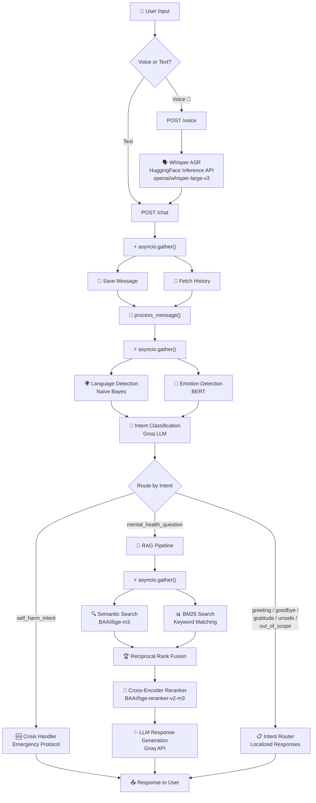

<p align="center">
  
  
  
  
  
</p>

<h1 align="center">🧠 MindCare AI</h1>

<p align="center">
  <strong>An Intelligent Multilingual Mental Health Support Chatbot</strong><br/>
  Powered by RAG, Emotion Detection, Voice Recognition, and Real-Time Crisis Intervention
</p>

<p align="center">
  <a href="#-features">Features</a> •
  <a href="#️-architecture">Architecture</a> •
  <a href="#-tech-stack">Tech Stack</a> •
  <a href="#-quick-start">Quick Start</a> •
  <a href="#-api-reference">API Reference</a> •
  <a href="#-pipeline-deep-dive">Pipeline</a> •
  <a href="#-model-metrics">Metrics</a>
</p>

---

## 📖 Overview

**MindCare AI** is a production-grade mental health support chatbot that combines multiple NLP techniques to provide empathetic, contextually aware, and safety-first responses. The system supports **20 languages**, processes both **text and voice input**, and uses a **Retrieval-Augmented Generation (RAG)** pipeline grounded in real counseling conversations.

### What Makes It Different?

| Feature | Description |
|---------|-------------|
| 🧠 **RAG-Grounded Responses** | Answers are based on real therapist-patient conversations, not hallucinated |
| 🎤 **Voice Input (Whisper)** | Users can speak instead of type — transcribed via HuggingFace Inference API |
| 🌍 **20 Languages** | Full multilingual support from Arabic to Vietnamese |
| 🆘 **Crisis Detection** | Real-time self-harm intent detection with emergency response protocol |
| ⚡ **Async Pipeline** | Fully parallelized with `asyncio` for maximum throughput |
| 🛡️ **Safety Guardrails** | Prompt injection detection + unsafe query blocking |

---

## 🏗️ Architecture

<p align="center">
  
</p>

### System Flow



---

## 🛠️ Tech Stack

### Backend

| Component | Technology | Purpose |
|-----------|-----------|---------|
| **Web Framework** | FastAPI | Async API server with auto-docs |
| **LLM Inference** | Groq API | Intent classification & response generation |
| **Embeddings** | BAAI/bge-m3 | Multilingual semantic embeddings |
| **Reranker** | BAAI/bge-reranker-v2-m3 | Cross-encoder relevance scoring |
| **Vector Database** | Qdrant | Semantic similarity search |
| **Keyword Search** | BM25Okapi | Traditional lexical retrieval |
| **Voice-to-Text** | OpenAI Whisper large-v3 (HF Inference API) | Automatic speech recognition |
| **Emotion Model** | HuggingFace BERT | 6-class emotion classification |
| **Language Detection** | Scikit-learn (Naive Bayes) | 20-language TF-IDF pipeline |
| **Database** | SQLite + SQLAlchemy | User accounts & chat history |
| **Authentication** | JWT (python-jose) | Token-based auth with Argon2 hashing |

### Frontend

| Component | Technology | Purpose |
|-----------|-----------|---------|
| **UI** | HTML5 + Vanilla JS + CSS | Dark-themed responsive chat interface |
| **Voice Recording** | MediaRecorder API | Browser-based audio capture |
| **Markdown Rendering** | marked.js | Rich bot response formatting |

### Async Architecture

| Operation | Strategy | Benefit |
|-----------|----------|---------|
| Language + Emotion Detection | `asyncio.gather()` | Run in parallel |
| Semantic + BM25 Search | `asyncio.gather()` | Run in parallel |
| Save Message + Fetch History | `asyncio.gather()` | Run in parallel |
| All ML Inference | `asyncio.to_thread()` | Non-blocking event loop |
| Whisper Transcription (HF API) | `asyncio.to_thread()` | Non-blocking event loop |

---

## 📂 Project Structure

```
MindCare-AI/
│
├── app/                          # 🖥️ FastAPI Application
│   ├── main.py                   # App entrypoint & router registration
│   ├── api/
│   │   ├── chat.py               # POST /chat — text chat endpoint
│   │   ├── voice.py              # POST /voice — voice chat endpoint
│   │   └── auth.py               # POST /auth/login, /auth/register, /auth/logout
│   ├── services/
│   │   ├── chatbot_service.py    # Core pipeline orchestrator (process_message)
│   │   ├── whisper_service.py    # Whisper ASR via HuggingFace Inference API
│   │   ├── chat_service.py       # Chat history CRUD operations
│   │   └── auth_service.py       # User registration & authentication
│   ├── core/
│   │   ├── database.py           # SQLAlchemy engine & session
│   │   ├── security.py           # JWT tokens & password hashing
│   │   └── config.py             # App configuration
│   ├── models/
│   │   ├── user.py               # User SQLAlchemy model
│   │   └── chat_message.py       # ChatMessage SQLAlchemy model
│   ├── schemas/
│   │   └── user.py               # Pydantic request/response schemas
│   ├── templates/
│   │   ├── chat.html             # Chat page with voice recording
│   │   ├── index.html            # Landing page
│   │   ├── login.html            # Login page
│   │   └── register.html         # Registration page
│   └── static/
│       ├── css/style.css         # Dark theme + recording animations
│       └── js/
│           ├── chat.js           # Chat logic + MediaRecorder voice recording
│           └── auth.js           # Authentication logic
│
├── classifier/                   # 🔬 NLP Classification Models
│   ├── emotion_inference.py      # BERT emotion classifier (6 classes)
│   ├── language_inference.py     # Naive Bayes language detector (20 languages)
│   ├── intent_classifier.py      # LLM-based intent engine (7 intents)
│   ├── preprocessor.py           # Unicode-aware multilingual text preprocessor
│   ├── utils.py                  # Helper utilities
│   └── *.joblib                  # Trained language detection models
│
├── rag/                          # 🧠 RAG Pipeline
│   ├── rag_pipeline.py           # Full retrieval-generation pipeline
│   └── crisis_handler.py         # Self-harm crisis response handler
│
├── locales/                      # 🌍 Multilingual Responses (20 languages)
│   ├── en.json                   # English
│   ├── ar.json                   # Arabic
│   ├── es.json                   # Spanish
│   ├── fr.json                   # French
│   ├── de.json                   # German
│   ├── ja.json                   # Japanese
│   ├── zh.json                   # Chinese
│   └── ... (13 more languages)
│
├── evaluation/                   # 📊 Evaluation & Testing
│   ├── dataset_builder.py        # RAG evaluation dataset builder
│   ├── eval_runner.py            # RAGAS evaluation runner
│   ├── gemini_llm.py             # Gemini LLM wrapper for eval
│   ├── groq_llm.py               # Groq LLM wrapper for eval
│   └── rag_wrapper.py            # RAG wrapper for eval framework
│
├── notebooks/                    # 📓 Training Notebooks
│   ├── Emtion_Classifier.ipynb   # BERT emotion model training
│   ├── Language_Detection.ipynb  # Language detection pipeline training
│   └── Intent_Classifier.ipynb   # Intent classification experiments
│
├── Mental_Health_System/         # 📦 End-to-End Pipeline Files
├── emotion-bert-final/           # 🤖 Fine-tuned BERT model weights
├── cache/                        # 💾 Embedding & Qdrant cache
├── config.py                     # ⚙️ Centralized configuration
├── pyproject.toml                # 📋 Project dependencies (uv)
└── .env                          # 🔑 API keys (not committed)
```

---

## 🚀 Quick Start

### Prerequisites

- **Python 3.14+**
- **uv** package manager ([install guide](https://docs.astral.sh/uv/getting-started/installation/))
- **Groq API Key** ([get one free](https://console.groq.com/))

### Step 1 — Clone the Repository

```bash
git clone https://github.com/Fayad-nullPointer/Health-Rag-System.git
cd Health-Rag-System
```

### Step 2 — Set Up Environment Variables

Create a `.env` file in the root directory:

```bash
# Required
GROQ_API_KEY=your_groq_api_key_here

# Optional (for evaluation & cloud features)
GEMINI_API_KEY=your_gemini_key
HF_TOKEN=your_huggingface_token
QDRANT_URL=your_qdrant_cloud_url
QDRANT_API_KEY=your_qdrant_api_key
REDIS_URL=redis://localhost:6379/0
JWT_SECRET=your_secret_key_change_in_production
```

### Step 3 — Install Dependencies

```bash
uv sync
```

### Step 4 — Run the Server

```bash
uvicorn app.main:app --host 0.0.0.0 --port 8000 --reload
```

### Step 5 — Open the App

Navigate to **http://localhost:8000** in your browser.

1. **Register** a new account at `/register`
2. **Login** at `/login`
3. **Start chatting** at `/chat` — type or click 🎤 to record voice

---

## 📡 API Reference

### Authentication

| Method | Endpoint | Description | Auth |
|--------|----------|-------------|------|
| `POST` | `/auth/register` | Create a new user account | ❌ |
| `POST` | `/auth/login` | Login and receive JWT token | ❌ |
| `POST` | `/auth/logout` | Logout (clears cookie) | ❌ |

#### Register

```bash
curl -X POST http://localhost:8000/auth/register \
  -H "Content-Type: application/json" \
  -d '{
    "username": "john",
    "email": "john@example.com",
    "password": "secure_password",
    "country": "US",
    "first_name": "John",
    "last_name": "Doe"
  }'
```

#### Login

```bash
curl -X POST http://localhost:8000/auth/login \
  -H "Content-Type: application/json" \
  -d '{"username": "john", "password": "secure_password"}'
```

**Response:**
```json
{
  "access_token": "eyJhbGciOiJIUzI1NiIs...",
  "token_type": "bearer",
  "username": "john",
  "full_name": "John Doe"
}
```

---

### Chat

| Method | Endpoint | Description | Auth |
|--------|----------|-------------|------|
| `POST` | `/chat` | Send a text message | ✅ Bearer Token |
| `POST` | `/voice` | Send a voice recording | ✅ Bearer Token |

#### Text Chat

```bash
curl -X POST http://localhost:8000/chat \
  -H "Content-Type: application/json" \
  -H "Authorization: Bearer YOUR_TOKEN" \
  -d '{"message": "I feel anxious about my upcoming exam"}'
```

**Response:**
```json
{
  "trace_id": "550e8400-e29b-41d4-a716-446655440000",
  "intent": "asking_mental_health_question",
  "language": "en",
  "emotion": "fear",
  "response": "It's completely normal to feel anxious before exams..."
}
```

#### Voice Chat

```bash
curl -X POST http://localhost:8000/voice \
  -H "Authorization: Bearer YOUR_TOKEN" \
  -F "audio=@recording.wav"
```

**Response:**
```json
{
  "trace_id": "...",
  "intent": "asking_mental_health_question",
  "language": "en",
  "emotion": "sadness",
  "response": "I hear you, and I want you to know...",
  "transcribed_text": "I've been feeling really down lately",
  "voice_language": null,
  "input_type": "voice"
}
```

---

## 🔬 Pipeline Deep Dive

### 1️⃣ Input Processing

```
User Input (text or voice)
    │
    ├─ TEXT ──────────────────────────────────── message string
    │
    └─ VOICE ── MediaRecorder ── WebM/Opus ──┐
                                              │
             HuggingFace Inference API ◄──────┘
             (openai/whisper-large-v3)
                         │
                    transcribed text
```

**Voice Processing:**
- Browser captures audio via `MediaRecorder` API (WebM/Opus codec)
- Audio is sent as `multipart/form-data` to `POST /voice`
- Audio bytes are sent to **HuggingFace Inference API** (`openai/whisper-large-v3`) — no local model needed
- Supports WAV, FLAC, WebM, and OGG formats

### 2️⃣ Parallel Classification (`asyncio.gather`)

Three classifiers run **simultaneously** for maximum speed:

| Classifier | Model | Input | Output | Latency |
|-----------|-------|-------|--------|---------|
| 🌍 Language | Naive Bayes (TF-IDF) | raw text | ISO 639-1 code (e.g., `en`, `ar`) | ~15ms |
| 💭 Emotion | BERT (`HagarGhazi/emotion-classifier-mental-health`) | raw text | One of 6 emotions | ~150ms |
| 🎯 Intent | Groq LLM (`llama-3.1-8b-instant`) | text + language + emotion | One of 7 intents | ~500ms |

**Supported Emotions:** `joy`, `sadness`, `anger`, `fear`, `love`, `surprise`

**Supported Intents:**

| Intent | Description | Route |
|--------|-------------|-------|
| `greeting` | Hello, hi, introductions | Localized response |
| `goodbye` | Farewell messages | Localized response |
| `gratitude` | Thank you, appreciation | Localized response |
| `asking_mental_health_question` | Emotional/psychological support | **RAG Pipeline** |
| `self_harm_intent` | Suicidal ideation, self-harm | **Crisis Handler** 🆘 |
| `unsafe_query` | Harmful, illegal, or injection attempts | Blocked response |
| `out_of_scope` | Unrelated topics | Polite redirect |

### 3️⃣ RAG Pipeline (for mental health questions)

```
Query ──► Hybrid Search ──► Reranking ──► Filtering ──► LLM Generation
             │                  │
     ┌───────┴───────┐    Cross-Encoder
     │               │    BAAI/bge-reranker-v2-m3
  Semantic         BM25
  Search          Search
  (bge-m3)      (keyword)
     │               │
     └───── RRF ─────┘
    (Reciprocal Rank Fusion)
```

**Retrieval Steps:**

1. **Hybrid Search** — Semantic (BAAI/bge-m3 → Qdrant) + BM25 run **in parallel**
2. **Reciprocal Rank Fusion** — Merges results by fused ranking scores
3. **Cross-Encoder Reranking** — BAAI/bge-reranker-v2-m3 re-scores top candidates
4. **Filtering** — Removes results below 0.18 rerank threshold
5. **Deduplication** — Exact + fuzzy (90% similarity) duplicate removal
6. **Quality Assessment** — `HIGH` if top score ≥ 0.30, else `LOW`
7. **Generation** — Groq LLM generates response grounded in retrieved contexts

**Dataset:** [`Amod/mental_health_counseling_conversations`](https://huggingface.co/datasets/Amod/mental_health_counseling_conversations) — real therapist-patient conversation pairs.

### 4️⃣ Crisis Handler 🆘

When `self_harm_intent` is detected:
- **Immediate priority** — overrides all other routes
- Generates a **safety-first response** via Groq LLM with strict guidelines:
  - ✅ Empathetic validation of emotional pain
  - ✅ Safety concern statement
  - ✅ Encouragement to reach real-world support
  - ✅ Simple grounding technique
  - ❌ Never provides self-harm methods
  - ❌ Never validates self-harm as an option
- Responds in the **user's detected language**

### 5️⃣ Localized Intent Responses

For non-RAG intents (`greeting`, `goodbye`, `gratitude`, `unsafe_query`, `out_of_scope`), the system returns pre-written localized responses from `locales/*.json`.

**Supported Languages (20):**

| | | | | |
|---|---|---|---|---|
| 🇬🇧 English | 🇸🇦 Arabic | 🇪🇸 Spanish | 🇫🇷 French | 🇩🇪 German |
| 🇮🇹 Italian | 🇵🇹 Portuguese | 🇷🇺 Russian | 🇨🇳 Chinese | 🇯🇵 Japanese |
| 🇮🇳 Hindi | 🇹🇷 Turkish | 🇳🇱 Dutch | 🇵🇱 Polish | 🇻🇳 Vietnamese |
| 🇹🇭 Thai | 🇰🇪 Swahili | 🇵🇰 Urdu | 🇬🇷 Greek | 🇧🇬 Bulgarian |

---

## 📊 Model Metrics

### Emotion Classifier (BERT)

Fine-tuned `bert-base-uncased` on [`dair-ai/emotion`](https://huggingface.co/datasets/dair-ai/emotion) dataset.

| Metric | Score |
|--------|-------|
| **Accuracy** | ~92–93% |
| **F1-Score** | ~92–93% |
| **Test Set** | 2,000 samples |
| **Classes** | 6 (joy, sadness, anger, fear, love, surprise) |

### Language Detection (TF-IDF + Naive Bayes)

Trained on [`papluca/language-identification`](https://huggingface.co/datasets/papluca/language-identification).

| Metric | Score |
|--------|-------|
| **Accuracy** | >98% |
| **Languages** | 20 |
| **Features** | `char_wb` n-grams (word-boundary character) |
| **Scripts** | Latin, Arabic, Cyrillic, CJK, Devanagari, Thai, and more |

### Intent Classification (LLM)

Groq-powered `llama-3.1-8b-instant` with zero-shot JSON output.

| Metric | Detail |
|--------|--------|
| **Confidence Threshold** | 0.65 |
| **Fallback** | Routes to `out_of_scope` if below threshold |
| **Temperature** | 0 (deterministic) |
| **Safety Priority** | `self_harm_intent` overrides all mental health categories |

---

## ⚡ Performance & Async Architecture

### Before vs After Optimization

| Scenario | Language | Emotion | Intent | RAG | **Total** |
|----------|---------|---------|--------|-----|-----------|
| ❌ Sequential | 20ms | 150ms | 520ms | 2000ms | **~2,690ms** |
| ⚡ Parallel (cache miss) | ←— 500ms (parallel) —→ | — | 2000ms | **~2,500ms** |
| 🚀 Full cache hit | — | — | — | — | **~10ms** |

### Parallelization Map

```mermaid
gantt
    title Async Pipeline Timeline
    dateFormat X
    axisFormat %Lms

    section Parallel Block 1
    Save Message        :a1, 0, 20
    Fetch History       :a2, 0, 20

    section Parallel Block 2
    Language Detection   :b1, 20, 35
    Emotion Detection    :b2, 20, 170

    section Sequential
    Intent Classification :c1, 170, 670

    section Parallel Block 3 (RAG)
    Semantic Search      :d1, 670, 870
    BM25 Search          :d2, 670, 690

    section Sequential (RAG)
    Reranking            :e1, 870, 920
    LLM Generation       :f1, 920, 2920
```



---

## 🔧 Configuration

All configuration is centralized in `config.py`:

| Parameter | Default | Description |
|-----------|---------|-------------|
| `CACHE_TTL_LANG` | 3600s | Language cache TTL |
| `CACHE_TTL_EMOTION` | 3600s | Emotion cache TTL |
| `CACHE_TTL_INTENT` | 3600s | Intent cache TTL |
| `CACHE_TTL_RAG` | 1800s | RAG response cache TTL |
| `MAX_MEMORY_MESSAGES` | 10 | Chat history window size |
| `JWT_EXPIRE_HOURS` | 24 | JWT token expiration |

---

## 📓 Notebooks

| Notebook | Description |
|----------|-------------|
| `Emtion_Classifier.ipynb` | BERT emotion model training, evaluation, and HuggingFace upload |
| `Language_Detection.ipynb` | TF-IDF + Naive Bayes language detection pipeline training |
| `Intent_Classifier.ipynb` | Intent classification experiments and prompt engineering |

---

## 🤝 Contributing

1. Fork the repository
2. Create a feature branch (`git checkout -b feature/amazing-feature`)
3. Commit your changes (`git commit -m 'Add amazing feature'`)
4. Push to the branch (`git push origin feature/amazing-feature`)
5. Open a Pull Request

---

## 📄 License

This project is licensed under the MIT License — see the [LICENSE](LICENSE) file for details.

---

## ⚠️ Disclaimer

MindCare AI is an **educational project** and is **NOT a substitute for professional mental health care**. If you or someone you know is in crisis, please contact your local emergency services or a crisis hotline immediately.

**Emergency Resources:**
- 🇺🇸 **988 Suicide & Crisis Lifeline**: Call or text **988**
- 🇬🇧 **Samaritans**: Call **116 123**
- 🌍 **International Association for Suicide Prevention**: [https://www.iasp.info/resources/Crisis_Centres/](https://www.iasp.info/resources/Crisis_Centres/)

---

<p align="center">
  Made with ❤️ by the <strong>Fayad-nullPointer</strong> Team
</p>
