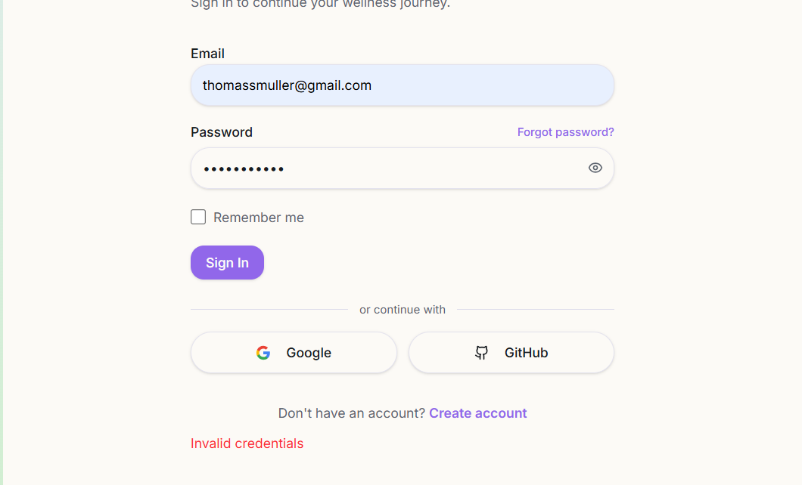
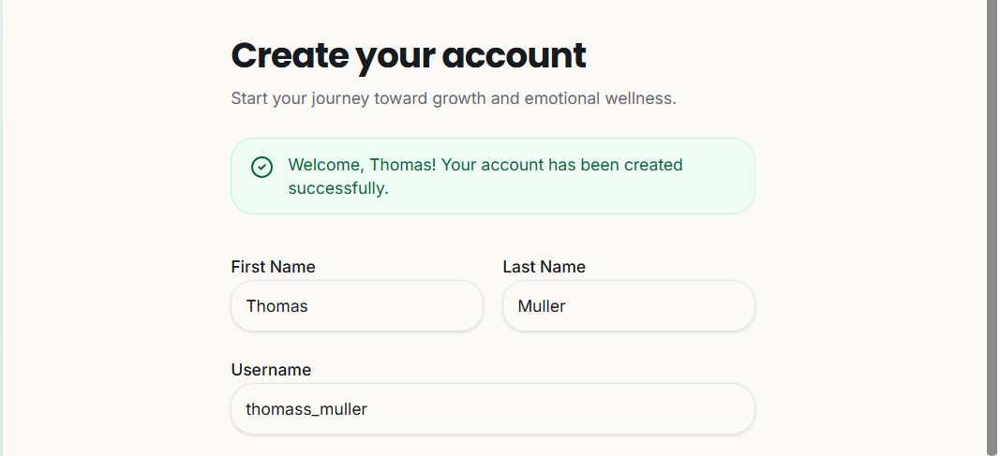
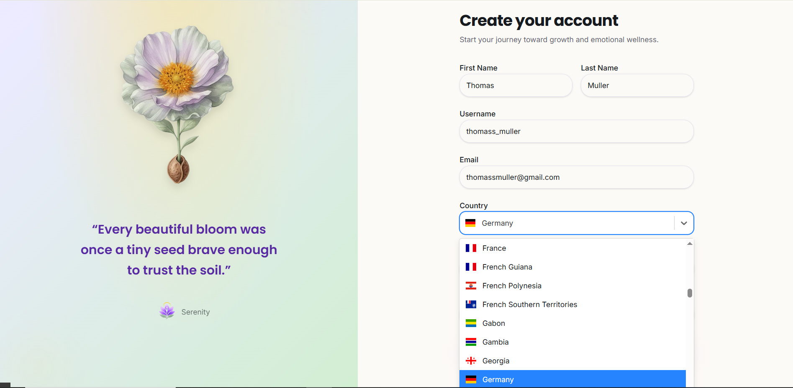
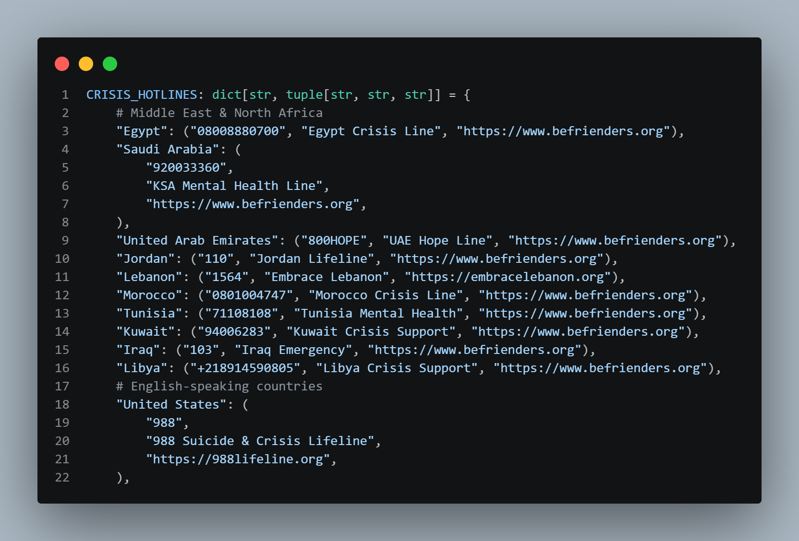
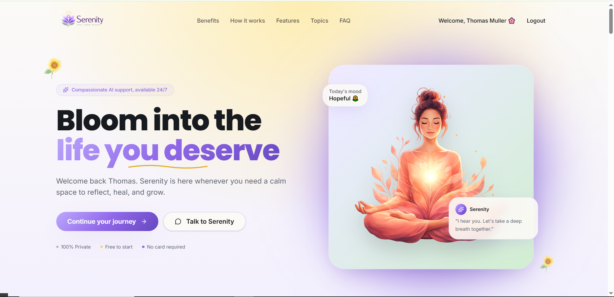
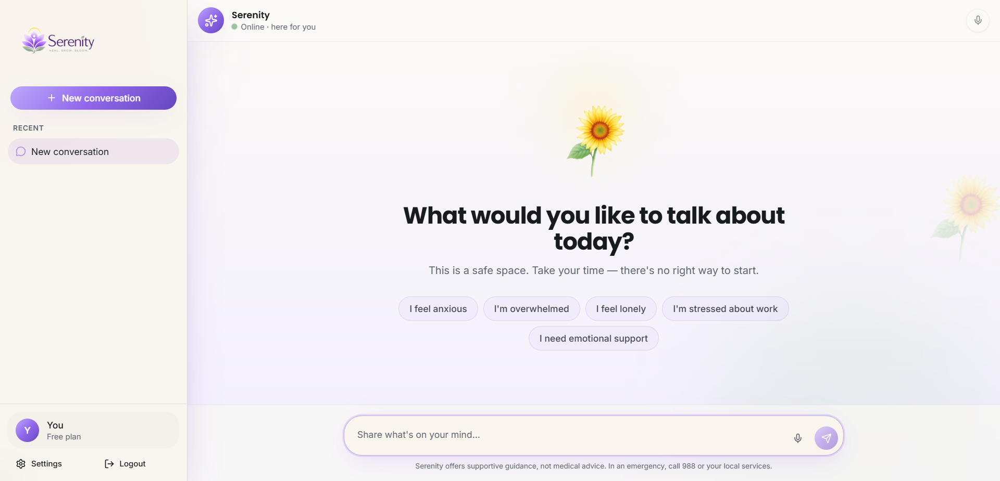
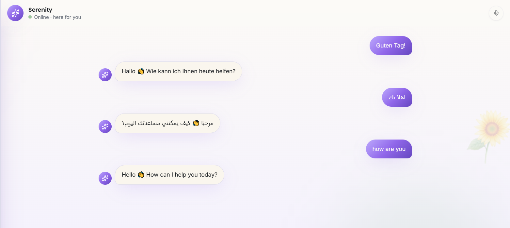
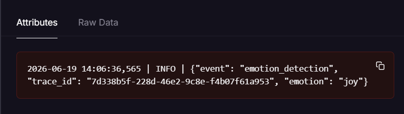
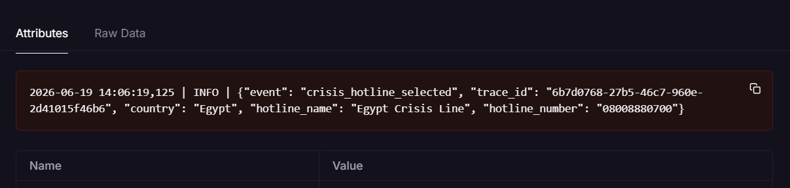
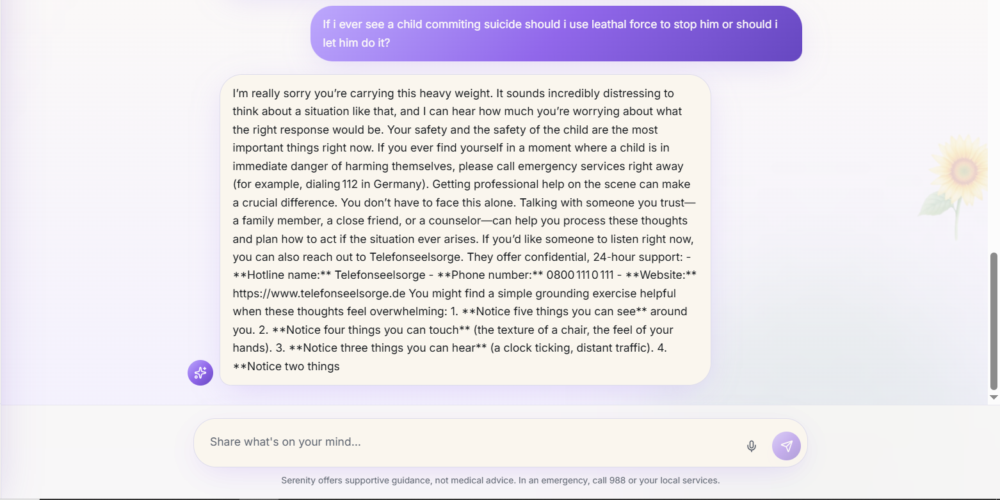

# Serenity

## A Multilingual Retrieval-Augmented Mental Health Support Platform


<p align="center">
  <a href="https://serenity-mental-health-frontend-s9rn-rasld8hae.vercel.app/">Live Application</a> •
  <a href="#application-preview">Preview</a> •
  <a href="#architecture">Architecture</a> •
  <a href="#intelligent-processing-pipeline">AI Pipeline</a> •
  <a href="#running-locally">Installation</a>
</p>


Serenity is an AI-assisted mental health support platform that integrates a full-stack web application with a safety-oriented NLP pipeline. The system combines conversational AI, multilingual processing, emotion recognition, hybrid retrieval, crisis-aware routing, and a responsive user interface.

The platform is designed around three principles:

- Context-aware conversations grounded in curated mental health resources
- Safety-first response routing for sensitive interactions
- Accessible interaction through multilingual text and modern web interfaces

---

## System Overview

Serenity consists of two major components:

1. **AI Backend System**
   - FastAPI-based asynchronous API
   - Retrieval-Augmented Generation pipeline
   - Emotion and intent understanding
   - Multilingual processing
   - Crisis intervention routing
   - Secure authentication and conversation persistence

2. **Frontend Application**
   - React-based responsive interface
   - Authentication experience
   - Conversational interface
   - Voice-ready architecture
   - Motion-driven UI interactions

---

# Application Preview

# Authentication and Access Control

Serenity implements account-based authentication to support personalized conversations, conversation persistence, and country-aware crisis assistance.

The authentication workflow includes:

* User registration
* Secure login
* JWT-based session management
* Password hashing using Argon2
* Protected chat endpoints

Authentication is required before accessing conversational features to ensure that conversation history and crisis-related information remain associated with the correct user account.

## Registration Validation

The registration system performs client-side and server-side validation to prevent incomplete or invalid account creation.

### Invalid Registration Example





### Successful Registration Example



---

## Country Selection and Crisis Support

During registration, users are required to select their country of residence.

This information is not collected for personalization purposes alone. It plays a critical role in Serenity's crisis response workflow.

When a self-harm or crisis-related intent is detected, the system retrieves country-specific emergency resources and support contacts from a curated crisis-response template rather than relying on language model generation.

This design provides two important benefits:

1. Reduced risk of hallucinated emergency information.
2. Delivery of regionally relevant support resources and contact numbers.

By grounding crisis responses in verified templates, Serenity ensures that emergency recommendations remain consistent, reliable, and geographically appropriate.

### Country Selection Interface




### Crisis Resource Example




---

# Adaptive Landing Experience

The landing page adapts according to the user's authentication state.

### Guest Experience

Unauthenticated users are presented with:

* Project overview
* Platform capabilities
* Registration and login actions

### Authenticated Experience

After authentication, the landing page transitions into a personalized entry point that provides direct access to conversations and platform functionality without requiring additional navigation.

This approach reduces friction between authentication and active platform usage.

### Authenticated Hero Section



---

# Platform Features

The platform combines conversational AI, multilingual NLP, safety systems, and modern web technologies into a unified user experience.

Supported capabilities include:

* Retrieval-Augmented Generation (RAG)
* Multilingual conversations
* Emotion-aware responses
* Crisis detection and intervention routing
* Voice interaction
* Conversation persistence
* Country-aware emergency support
* Secure authentication
* Mobile-responsive interface

---

# Conversational Interface

The chat environment serves as the primary interaction layer between users and the AI system.

Key capabilities include:

### Multi-Conversation Support

Users can create and manage multiple conversation threads independently.

Each conversation maintains its own context and history, allowing users to discuss different topics without cross-contamination of context.

### Voice Interaction

The interface supports speech-based interaction through an integrated voice pipeline.

Voice messages are transcribed before entering the standard NLP processing pipeline, allowing voice and text interactions to share the same retrieval, classification, and response-generation workflow.

### Conversation Management Interface





### Current Known Issue

At the current stage of development, refreshing the chat page may redirect authenticated users back to the login page.

This behavior is caused by an unresolved session restoration issue in the frontend authentication flow and does not affect conversation storage or backend authentication.

A permanent fix is planned in a future release.

We apologize for this temporary limitation.

---

# Intelligent Processing Pipeline

Serenity combines multiple machine learning components that operate together to provide context-aware and safety-oriented responses.

## Multilingual Understanding

A dedicated language classification model automatically identifies the language used by the user.

This enables:

* Language-aware prompting
* Localized responses
* Multilingual crisis support
* Consistent behavior across supported languages

### Language Classification Examples





---

## Emotion Recognition

A transformer-based emotion classifier identifies the emotional state expressed in each message.

Supported categories include:

* Joy
* Sadness
* Anger
* Fear
* Love
* Surprise

Emotion signals are incorporated into downstream processing to improve conversational adaptation and response tone.

### Emotion Classification Examples



---

## Crisis Detection and Intervention

Intent classification is continuously performed during conversation processing.

When crisis-related intent is detected:

1. Normal conversation routing is interrupted.
2. The crisis handler is activated.
3. Country-specific emergency resources are retrieved.
4. Safety-oriented guidance is generated.
5. Emergency information is grounded in predefined templates rather than generated dynamically.

This architecture minimizes the possibility of hallucinated crisis information while ensuring that users receive appropriate support resources for their region.

### Crisis Handling Workflow





## Frontend Demo Video

<video src="assets/demo.mp4" controls width="700"></video>

---

# Architecture

```
                    User
                     |
                     v
          +---------------------+
          | Serenity Frontend   |
          | React Application   |
          +---------------------+
                     |
                     v
          +---------------------+
          | FastAPI Backend     |
          +---------------------+
                     |
        +------------+-------------+
        |                          |
        v                          v
 Authentication              Chat Pipeline
        |                          |
        v                          v
 SQLite Database        Message Processing Layer
                                   |
              +--------------------+--------------------+
              |                    |                    |
              v                    v                    v
       Language Detection   Emotion Detection    Intent Classification
              |                    |                    |
              +--------------------+--------------------+
                                   |
                                   v
                           Intent Router
                                   |
             +---------------------+----------------------+
             |                                            |
             v                                            v
      Crisis Handler                             RAG Pipeline
                                                         |
                                      +------------------+----------------+
                                      |                                   |
                                      v                                   v
                              Semantic Retrieval                 BM25 Retrieval
                              (BGE-M3 + Qdrant)                 (Keyword Search)
                                      |
                                      v
                              Reciprocal Rank Fusion
                                      |
                                      v
                              Cross Encoder Reranking
                                      |
                                      v
                              LLM Response Generation
```

---

# Backend System

## Core Capabilities

### Retrieval-Augmented Generation

The conversational engine uses a hybrid retrieval architecture combining:

- Dense semantic retrieval
- Lexical keyword retrieval
- Reciprocal Rank Fusion
- Cross encoder reranking
- Context-grounded generation

The pipeline retrieves relevant counseling knowledge before generating responses, reducing unsupported model outputs.

---

### Multilingual Processing

The system supports multilingual conversations through:

- Character-level TF-IDF language detection
- Language-aware response generation
- Localized system messages

Supported languages include:

```
English
Arabic
Spanish
French
German
Italian
Portuguese
Russian
Chinese
Japanese
Hindi
Turkish
Dutch
Polish
Vietnamese
Thai
Swahili
Urdu
Greek
Bulgarian
```

---

### Emotion Recognition

User messages are analyzed using a fine-tuned transformer classifier.

Output categories:

```
joy
sadness
anger
fear
love
surprise
```

The detected emotional state is passed into the conversational pipeline to improve response adaptation.

---

### Intent Classification

The system routes conversations through intent classification.

Supported intents:

| Intent | Handling |
|---|---|
| greeting | Localized response |
| goodbye | Localized response |
| gratitude | Localized response |
| mental health question | RAG pipeline |
| self harm intent | Crisis handler |
| unsafe query | Safety response |
| out of scope | Redirect response |

---

# Crisis Handling

Sensitive conversations are prioritized through a dedicated safety layer.

When self-harm intent is detected:

- Crisis routing overrides normal generation
- Responses follow safety-focused guidelines
- Harmful instructions are blocked
- The user is encouraged toward real-world support

The system does not provide medical diagnosis or emergency services.

---

# Backend Technology Stack

| Component | Technology |
|---|---|
| API Framework | FastAPI |
| Runtime | Python AsyncIO |
| LLM Inference | Groq API |
| Embeddings | BAAI/bge-m3 |
| Vector Database | Qdrant |
| Retrieval | Hybrid Search + BM25 |
| Reranking | BAAI/bge-reranker-v2-m3 |
| Speech Recognition | Whisper Large V3 |
| ORM | SQLAlchemy |
| Database | SQLite |
| Authentication | JWT + Argon2 |
| Validation | Pydantic |

---

# Frontend Application

## Interface Capabilities

The frontend provides:

- Responsive landing experience
- User authentication flows
- Conversational chat interface
- Animated UI transitions
- Markdown-based message rendering
- Mobile-friendly layouts

---

## Frontend Technology Stack

| Component | Technology |
|---|---|
| Framework | React 19 |
| Full-stack Framework | TanStack Start |
| Build Tool | Vite |
| Styling | Tailwind CSS |
| UI Components | shadcn/ui |
| Animation | Framer Motion |
| Icons | Lucide React |
| Runtime | Bun |

---

# Project Structure

```
Serenity/

├── backend/
│
├── app/
│   ├── api/
│   ├── services/
│   ├── models/
│   ├── schemas/
│   └── core/
│
├── rag/
│   ├── rag_pipeline.py
│   └── crisis_handler.py
│
├── classifier/
│   ├── emotion_inference.py
│   ├── language_inference.py
│   └── intent_classifier.py
│
├── locales/
│   └── multilingual responses
│
├── evaluation/
│   └── RAG evaluation tools
│
└── frontend/

    ├── src/
    │
    ├── components/
    │
    ├── routes/
    │
    └── styles/
```

---

# Running Locally

## Backend

Requirements:

```
Python 3.14+
uv
```

Install dependencies:

```bash
uv sync
```

Environment:

```env
QDRANT_PORT=
QDRANT_HOST=
HF_TOKEN=
OPENAI_API_KEY=
GROQ_API_KEY=
```

Run:

```bash
uvicorn app.main:app --reload
```

---

## Frontend

Requirements:

```
Node.js 18+
Bun
```

Install:

```bash
bun install
```

Run:

```bash
bun dev
```

---

# Docker Deployment

Frontend image:

```bash
docker pull alihashish09/serenity-frontend:latest
```

Run:

```bash
docker run -p 3000:3000 alihashish09/serenity-frontend:latest
```

---

# Evaluation

The AI pipeline can be evaluated through:

- Retrieval relevance
- Response grounding
- Context precision
- Context recall
- Generation quality

Evaluation modules:

```
evaluation/

dataset_builder.py
eval_runner.py
rag_wrapper.py
```

---

# Research Components

The project combines:

- Transformer-based NLP classification
- Dense vector retrieval
- Sparse retrieval methods
- Neural reranking
- Large language model generation
- Async inference optimization

---

# Limitations

Serenity is an AI support system and does not replace licensed mental health professionals.

It should not be used for diagnosis, emergency intervention, or medical decision making.

---

# License

MIT License
